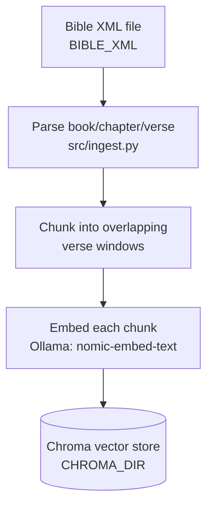
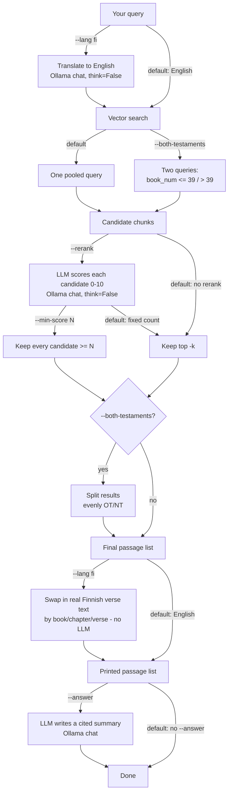

# How this RAG system works

A guide to the concepts behind this project and how the pieces fit
together — useful if you're new to RAG, or just want to know which
step does what before flipping a flag.

## RAG in three sentences

**RAG (Retrieval-Augmented Generation)** means: don't ask a language
model to answer from memory — instead, search your own data for the
relevant pieces first, then hand those pieces to the model as context.
Here, "your own data" is the Bible text, "search" is comparing
*embeddings* (numeric fingerprints of meaning, not keywords), and the
model's job is just to read what was found and comment on it, not to
recall Bible verses from its training data.

This matters because it makes answers **checkable**: every claim can be
traced back to an actual verse reference, instead of trusting the model
not to misremember or invent one.

## Version 1: the basic version

The simplest possible version of this idea is two steps:

1. Turn every chunk of Bible text into an embedding vector and store it.
2. Turn the search query into an embedding vector the same way, and
   return whichever stored chunks are numerically closest to it.

That's it — no LLM involved in the search itself, just embedding math
(cosine/L2 distance between vectors). This is exactly what
`python -m src.query "God as healer"` does by default: `src/ingest.py`
built the vector store once, and a plain query just asks Chroma for the
nearest neighbors.

This basic version is fast and needs no chat model at all — but it has
two weaknesses this project specifically ran into:

- **Precision**: "closest in embedding space" isn't the same as
  "actually about your theme." A query like "God as healer" pulls in
  passages that merely share vocabulary (e.g. "salvation") without
  being about healing at all.
- **Recall/coverage**: if one part of the Bible's vocabulary happens to
  sit closer to typical English search phrasing than another does (in
  practice: the New Testament's healing/shepherd/grace language vs. the
  Old Testament's), the *other* part can be almost entirely absent from
  results — not just ranked lower, but never even considered.

## Version 2: what was actually built

The version in this repo keeps step 1 unchanged (embeddings still do
the heavy lifting) but adds three optional refinement stages on top,
each aimed at one of those weaknesses, plus a language layer. None of
them touch how the Bible text is indexed — they only change what
happens to a query and its candidate results.

| Stage | Flag | Problem it addresses | Uses a local LLM? |
|---|---|---|---|
| Vector search | *(always on)* | Find semantically similar chunks | No — embedding model only (`nomic-embed-text`) |
| Reranking | `--rerank` | Precision: embedding-similar ≠ actually relevant | **Yes** — chat model scores each candidate, `think=False` |
| Recall mode | `--min-score N` | A fixed top-k hides how many places a theme appears | No new call — reuses the rerank scores, just changes the cutoff |
| Testament balancing | `--both-testaments` | One testament's vocabulary can crowd out the other | No — done via a metadata filter in the vector search, not an LLM |
| Language | `--lang fi` | Query/answer in Finnish, index stays English | **Yes** — chat model translates the query, `think=False` |
| Answer synthesis | `--answer` | Turn a passage list into a readable summary | **Yes** — chat model, `think=True` (English) or `think=False` (Finnish) |

So: **embeddings always do the searching**; the **chat model only gets
involved when you ask it to** (reranking, translation, or the final
summary) — and by default (no flags beyond a query), it's not involved
at all. See the "Asking in another language" and "Reranking" sections
of the [README](README.md) and [RERANKING.md](RERANKING.md) for the
detailed reasoning (and a couple of surprising failure modes around
`think=True` vs `think=False`) behind that column.

## The full pipeline

### Ingest (once, offline)

`CHUNK_SIZE`/`CHUNK_OVERLAP` (in `.env`) control the sliding window — a
chunk never spans a chapter boundary, and each chunk stores its book
number, chapter, and verse range as metadata alongside the embedding.

### Query (every search)

A few things worth noticing in that diagram:

- **The chat model never searches.** It only ever scores or comments on
  chunks the vector search already found. If the right verse never
  gets embedded-close enough to be a candidate, no later flag can
  recover it — which is exactly why `--both-testaments` intervenes
  *before* search (a second query with a metadata filter), not after.
- **`--lang fi`'s verse-swap step (`src/lang_lookup.py`) is not an LLM
  call.** It's a plain dictionary lookup into a second, separately
  parsed XML file (`FinnishBible.xml`, via `BIBLE_REPO_PATH`), keyed by
  the same book/chapter/verse numbers the English search already found.
  This is why the Finnish output is a real translation, not a
  paraphrase — the LLM is never asked to translate scripture, only to
  translate short *queries* and *summarize* found passages.
- **`--answer` is the only stage that generates new text** rather than
  selecting or scoring existing text. Every other stage either narrows
  down candidates or substitutes already-existing verse text.

## Where each option lives in the code

- `src/ingest.py` — parses XML, chunks, embeds, writes to Chroma (run once, or after changing `BIBLE_XML`/chunking settings)
- `src/query.py` — orchestrates everything below per query
- `src/rerank.py` — the `--rerank`/`--min-score` scoring step
- `src/translate.py` — the `--lang` query-translation step
- `src/lang_lookup.py` — the `--lang` verse-text-swap step (no LLM)
- `src/books.py` — book number ↔ name maps (English/Finnish) and the OT/NT boundary
- `src/ollama_client.py` — the one place that talks to Ollama (`embed()` and `chat()`)
